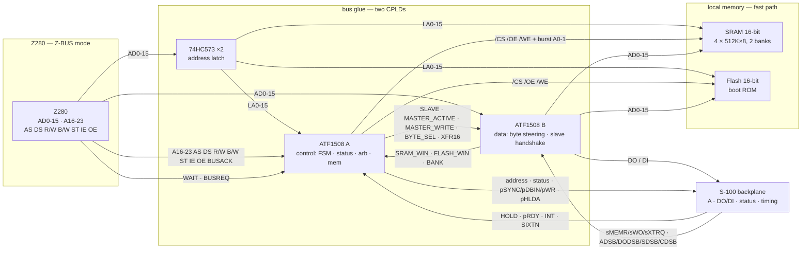
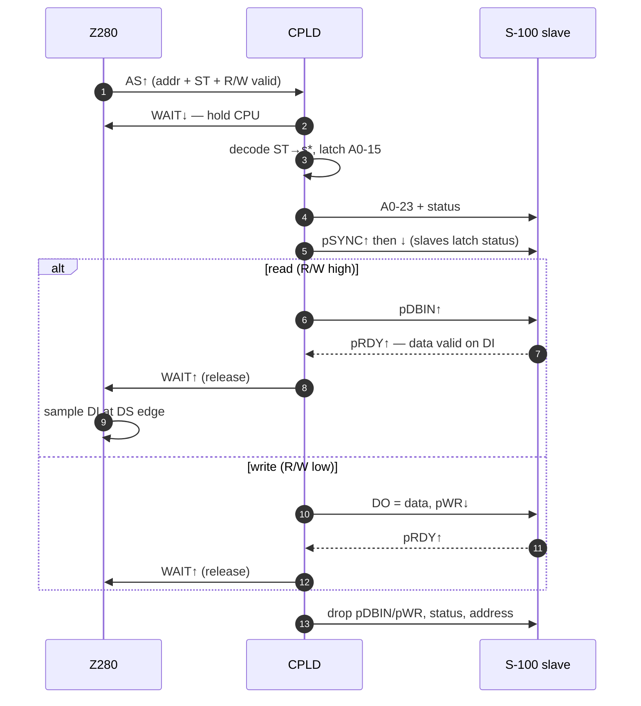
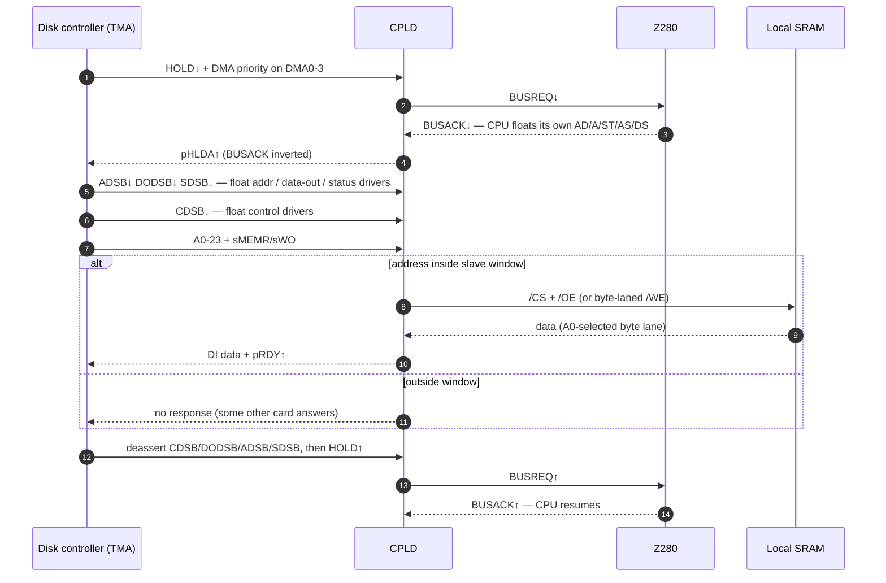

# Z280 S-100 CPU Card

> Reference design · rev 0

A 16-bit **Z-BUS → IEEE-696** bridge: word-wide SRAM with burst instruction fetch, exposed as an S-100 slave so temporary-master disk controllers can DMA straight into main memory.

| | |
|---|---|
| **CPU** | Zilog Z280 · Z-BUS mode (`OPT = 1`) |
| **Glue** | 2 × Microchip ATF1508 CPLD (control + data path) |
| **Bus** | S-100 / IEEE-696 · 16-bit, 8-bit fallback |
| **Memory** | 2 MB word-wide SRAM (4 sockets) + flash boot |

---

## 1. What the card is

The Z280 talks a multiplexed 16-bit **Z-BUS**; the S-100 bus talks an Intel-style split **DO/DI** bus with a status-latch / ready handshake. The two don't line up, so the card is mostly two CPLDs plus a row of latches and bus drivers. Its job splits cleanly in two:

- **Fast path** — the on-card SRAM hangs directly off the Z-BUS. Address is demultiplexed by the `AS` strobe into a pair of `74HC573` latches; the control CPLD only does chip-select (plus the burst address counter). Zero wait states, so the Z280's on-chip 256-byte cache fills in **burst** at bus speed.
- **Slow path** — anything outside local memory becomes an S-100 cycle. The CPLD decodes the Z-BUS status lines into the S-100 status byte, drives `pSYNC`/`pDBIN`/`pWR`, and holds the Z280's `WAIT` line until the addressed slave asserts `pRDY`.

The third requirement — **temporary-master access to local SRAM** — turns the card into a bus slave too. When a disk controller asserts `HOLD`, the card parks the CPU and re-exposes its SRAM to the backplane at a jumper-selected address window, so a DMA controller can read and write it directly.



*Block diagram — the control CPLD (A) routes each Z-BUS transaction to either the fast local path or the slow S-100 path; the data-path CPLD (B) steers bytes between the shared AD bus and the S-100 DO/DI lanes.*

---

## 2. The bridge: Z-BUS → S-100

### Status decode

The Z-BUS identifies a transaction with four status lines (`ST3–0`) plus `R/W`. The CPLD translates that into the S-100 status byte on the falling edge of `pSYNC`:

| Z-BUS ST3–0 | Meaning | S-100 status | Strobe |
|---|---|---|---|
| `1000` | CPU mem, cacheable | `sMEMR` (+ `sWO` if write) | pDBIN / pWR |
| `1001` | CPU mem, non-cacheable | `sMEMR` (+ `sWO` if write) | pDBIN / pWR |
| `0010` | I/O transaction | `sINP` (read) / `sOUT` (write) | pDBIN / pWR |
| `0011` | Halt | `sHLTA` | — |
| `0100–0111` | INT ack A/B/C, NMI | `sINTA` | pDBIN (vector read) |
| `0001` | Refresh | — | ignored |
| `1010, 11xx, 1110–1111` | EPU / test-and-set | — | not used here |

`sWO` is simply the complement of `R/W` (R/W low = write). The cacheable vs non-cacheable split comes *from* the Z280's MMU page attributes — the card doesn't decide it; it just routes both as memory. Non-cacheable pages are how the OS keeps DMA buffers coherent (see §4).

### Master cycle

The whole bridge is the `WAIT`-stretched cycle below. The Z280 raises `AS` to start; the control CPLD holds `WAIT` low for the entire off-card cycle and releases it only when `pRDY` (or `XRDY`) says the slave is done.



*Master-mode memory cycle — the Z280 is stretched with WAIT while the control CPLD runs the S-100 handshake underneath it.*

### 16-bit handshake

When the Z280 does a word access (`B/W` low), the control CPLD asserts `sXTRQ` during `pSYNC`. If the addressed slave answers `SIXTN`, the transfer goes through the full 16-bit path — the two data buses ganged per IEEE-696, `DO0–7` carrying the even byte (A0=0) and `DI0–7` the odd byte (A0=1). If not, the control CPLD splits it into two 8-bit cycles on the low lane — two `pSYNC` groups, byte-address bit steering the low byte first. That's the entire "8-bit fallback": a single register in the control CPLD that remembers the master asked for 16 bits and the slave said no.

> **Timing to verify:** the exact edge where the Z-BUS samples `WAIT` relative to `DS`, and the `AS` setup/hold for latching `AD0–15`, come from the Z-BUS timing figures in the manual (ch. 13) — follow those, not the Z80-bus description in ch. 12.

---

## 3. Local memory & burst fetch

Local SRAM is **word-wide**: four 8-bit parts in two banks, data lines tied straight to the shared `AD0–15` bus, address from the demux latch — except the low two word-address bits, which come from the burst counter in the control CPLD. Reads use the Z280's own `IE` as the SRAM `/OE`, writes use `DS` gated with `R/W` as `/WE` — so a local access is *not* an S-100 cycle at all, just decode + chip-select. That's what makes burst work.

The Z280's cache fill is not a separate bus protocol — there's no `BURST` pin. It is **one Address Strobe followed by four Data Strobes** (§13-9): the CPU presents the address once on `AS`, then issues four back-to-back reads on `DS` without re-asserting the address. The card must therefore auto-increment the word address between strokes — a 2-bit counter in the control CPLD steps the SRAM's low two word-address bits (`A1`/`A2`, byte `A0` stays 0) on each `DS`. Because the SRAM answers in a single bus cycle with no wait states, the fill runs at full bus rate. This only works because those fetches stay on the fast path; the moment a fetch crosses to the backplane it picks up S-100 wait states.

> **Part choice:** the `IS61C5128AS-25` (512K×8, 25 ns, 5 V) is far inside the 12 MHz bus cycle (≈83 ns) — zero wait states and full burst with no decode-timing constraint at all. Four of them give 2 MB word-wide in two banks (each chip is one byte lane, `A0` selects the lane; `A20` selects the bank). Keep the traces to these fast parts short and decouple them well.

### Address map (physical, bus-decode view)

| Range | Size | Target | Notes |
|---|---|---|---|
| `000000–1FFFFF` | 2 MB | Local SRAM | Micronix runtime; zero-wait, burst, cacheable; two banks via A20 |
| `F00000–F3FFFF` | 256 KB (socket to 512 KB) | Boot flash | 32-pin socket; CPLD overlays flash on the reset vector at power-up, then remaps |
| `200000–EFFFFF` | ~14 MB | S-100 memory | Off-card memory cards; mark non-cacheable |
| `I/O 0000–FDFF` | 64 KB | S-100 I/O | Ports FE/FF stay on-chip (UART, timers, MMU) |

The local/S-100 split is a decode in the data-path CPLD (B) of the `A16–23` address window, so it's re-programmable. The reset-vector overlay is a small latch in the control CPLD: flash answers at the reset address until boot code writes a remap bit.

---

## 4. Slave mode: DMA into local SRAM

This is the requirement that makes the card a real S-100 citizen. A disk controller that wants to DMA into Micronix's buffers takes over the bus as a **temporary master**; the CPU card must then look like ordinary memory. The MPZ80, HD/DMA and DJ/DMA all implement the full IEEE-696 handoff, so this card must too. Arbitration and access:



*Temporary-master arbitration — the CPU answers HOLD with pHLDA, the TMA floats the card's drivers with the four disable lines, then the card serves its SRAM as a slave.*

- **Driver handoff (required).** The TMA does not rely on the CPU floating itself — it takes the drivers over by asserting the four IEEE-696 disable lines: `ADSB*` (address), `DODSB*` (data-out), `SDSB*` (status), `CDSB*` (control). These gate the data-path CPLD's buffer output-enables. `pHLDA` is **not** gated by `CDSB*` — it is the permanent master's exclusive output and stays driven. There is exactly one bus master; each temporary master gets the bus by going *through* the master (a temporary never yields directly to another temporary), so `pHLDA` has no contention to float against. The HD/DMA floats data/address/status before control (two-step); the DJ/DMA asserts `CDSB*` first — either way all four must be honored.
- **Slave window.** The SRAM appears on the backplane at a jumper/CPLD-selected base — default `000000–0FFFFF` so a 20-bit (or even 16-bit) DMA controller can reach every byte. The window must not collide with other cards on the backplane.
- **Byte lane.** The Morrow DMA controllers are 8-bit, so a slave access is a single byte. The word-wide SRAM is built from four 8-bit parts in two banks; `A0` selects the lane and `A20` the bank: `/OE`/`/WE` go to the chip holding the addressed byte, and data moves on `DO0–7`/`DI0–7`. `SIXTN` is asserted only in answer to `sXTRQ`, so a 16-bit TMA still gets a 16-bit cycle.
- **Ready.** As a slave the card drives `pRDY`/`XRDY` after the SRAM access time, exactly like any memory card.

> **Cache coherency is the trap.** A TMA write lands in SRAM while the Z280's 256-byte cache may hold a stale copy of that line. Two fixes: mark the DMA/shared buffers **non-cacheable** in the MMU (ST = `1001`, so the CPU always hits the bus), or have the OS flush/invalidate the cache after each DMA — cheap, since the whole cache is only 256 bytes. Pick one and make it a hard rule in the DMA driver.

The Z280's own four-channel on-chip DMA (with `DMASTB`/`EOP`) remains available for on-card peripherals that want flyby transfers without bus arbitration — but it isn't needed for the temporary-master requirement above.

---

## 5. Signal interfaces

### Z-BUS side (ch. 13, signals this card uses)

| Signal | Dir | Active | Role on this card |
|---|---|---|---|
| `AD0–15` | bidir | high | muxed addr/data → latch (addr) + SRAM/flash data + DO/DI path |
| `A16–23` | out | high | upper address → decode + S-100 A16–23 |
| `AS` | out | low | address strobe — rising edge latches AD0-15, starts FSM |
| `DS` | out | low | data strobe — times data, reference for WAIT sample |
| `R/W` | out | low=wr | direction → sWO, SRAM /WE |
| `B/W` | out | low=word | word vs byte → sXTRQ / split |
| `ST3–0` | out | high | status → decoded to S-100 s* lines |
| `IE / OE` | out | low | read / write enables — gate DI into AD, AD onto DO/SRAM |
| `WAIT` | in | low | held low while an S-100 cycle completes |
| `BUSREQ / BUSACK` | in / out | low | bus handoff for temporary-master arbitration |
| `INT / NMI` | in | low | interrupts from backplane / local |
| `RESET` | in | low | power-on + S-100 pRESET |
| `XTALI/XTALO · CLK` | in/out | — | crystal in, bus clock out (FSM timing ref) |
| `OPT` | in | — | tie high = Z-BUS mode |
| `TxD / RxD` | out / in | high | console UART |

### S-100 side (signals this card drives or reads)

| Signal | Master | Slave | Purpose |
|---|---|---|---|
| `A0–23` | drive | receive | address |
| `DO0–7` | drive (write) | receive (write) | data out — the even byte (A0=0) |
| `DI0–7` | receive (read) | drive (read) | data in — the odd byte (A0=1) |
| `sMEMR/sWO/sINP/sOUT/sINTA/sHLTA` | drive | receive | status |
| `sXTRQ` | drive | receive | 16-bit request |
| `SIXTN` | receive | drive | 16-bit acknowledge |
| `pSYNC/pSTVAL/pDBIN/pWR` | drive | receive | cycle timing |
| `pHLDA` | drive | — | grant bus to a TMA (active high, from BUSACK) |
| `HOLD` | receive | — | temporary-master request |
| `ADSB` | receive | — | TMA disables my address drivers |
| `DODSB` | receive | — | TMA disables my data-out drivers |
| `SDSB` | receive | — | TMA disables my status drivers |
| `CDSB` | receive | — | TMA disables my control drivers |
| `pRDY / XRDY` | receive | drive | ready handshake |
| `INT / NMI / pRESET` | receive | receive | interrupts, reset |

> **Pin numbers** are per IEEE-696 and your backplane — the ones this card leans on are `pSYNC`=76, `pWR`=77, `pDBIN`=78, `sXTRQ`=58, `SIXTN`=60, `HOLD`=74, `pHLDA`=26 (active high), the disable lines `SDSB`=18, `CDSB`=19, `ADSB`=22, `DODSB`=23, power at 1 (+8V), 2 (+16V), 51 (+8V), 52 (−16V), 50/100 (GND). Confirm the address/data pins against the standard before wiring.

---

## 6. CPLDs: two ATF1508

Two **ATF1508** parts (128 macrocells, 5 V, JTAG/ISP, 84-pin PLCC, 64 I/O each) split the design down a clean seam: everything that *decides* a cycle lives in the **control CPLD (A)**, everything that *moves bytes* lives in the **data-path CPLD (B)**. The original single-part design used ~70 macrocells but 69 general I/O — past the 64-I/O ceiling — so two parts give 128 I/O and 256 macrocells of headroom. Bonus: each CPLD re-spins independently over JTAG, so a master-FSM fix doesn't touch the byte steering and vice versa.

### Control CPLD (A) — the decider

Owns the Z-BUS interface and never touches a data line:

- **Master FSM** — idles until `AS`, decides local vs S-100, runs the WAIT-stretched S-100 handshake, and holds the 16→8 split latch.
- **Status/control generation** — decodes `ST3–0` into the S-100 status byte and the `pSYNC`/`pDBIN`/`pWR` timing.
- **Local memory control** — SRAM/flash chip-selects, byte-laned `/WE`, and the **burst counter** (the 2-bit loadable counter that auto-increments the SRAM word address on each `DS`).
- **Arbitration** — `HOLD`→`BUSREQ`→`pHLDA` and the `SLAVE`/`MASTER` split.
- **Interrupts** — `INT`/`NMI` routing.

It only *reads* `pRDY`/`XRDY`/`SIXTN`; the open-drain drive of those lives in B.

### Data-path CPLD (B) — the mover

Hangs `AD0–15` (16 bidir) on the shared AD bus and `DO0–7`/`DI0–7` (16 bidir) straight on the S-100 edge, and does the IEEE-696 even/odd byte steering *inside* — there are no external data transceivers:

- **Byte mux (2×2 crossbar)** — `DO0–7` carries the even byte (A0=0), `DI0–7` the odd (A0=1); the mux steers each byte to the right `AD` lane and reverses for 8-bit split cycles.
- **Slave handshake** — open-drain `SIXTN`/`pRDY`/`XRDY` drive.
- **Buffer OE/DIR** — the address/status/control 74HCT245 drivers, gated by `ADSB`/`DODSB`/`SDSB`/`CDSB`.
- **Address decode** — reads `A16–23`, emits `SRAM_WIN`/`FLASH_WIN`/`BANK` back to A.

### Handoff between the two

Five steering decisions A computes that B can't see, three decode lines B computes that A needs:

```
A ──► B:  SLAVE · MASTER_ACTIVE · MASTER_WRITE · BYTE_SEL · XFR16
B ──► A:  SRAM_WIN · FLASH_WIN · BANK
```

### Pin budgets

| CPLD | Inputs | Bidir | Outputs | Total | General I/O (ex-JTAG) |
|---|---|---|---|---|---|
| A — control | 29 | 0 | 32 | 61 | 57 |
| B — data path | 23 | 32 | 12 | 67 | 63 |

Both fit the 64 general I/O; the four JTAG pins are dedicated on the 84-pin PLCC. The 7 ns grade is fine — two parts cost nothing new when they're already on hand.

### JTAG programming

One 1×6 header programs both parts in a single chain: `TCK`/`TMS` wired in parallel, `TDI`→A→B→`TDO` in series. The ISP tool selects a device positionally — chain order, not an address — by loading the target's ISP instruction and BYPASS into the others, then shifting data to just that part (see §9).

---

## 7. I/O, clock, power

**Console.** The Z280's on-chip UART is the console. `TxD`/`RxD` go through a `MAX232` (or 1488/1489) to a DE-9 — no SIO card needed. Baud from the on-chip generator if available, else a 1.8432 MHz oscillator for standard rates.

**Interrupts.** Backplane `INT` → Z280 `INT` (level), `NMI` → `NMI`. Vectored interrupts work via the `sINTA` cycle (ST = `0100–0111`), where the Z280 reads the vector off the bus like any I/O read — wire it if a controller needs it; otherwise keep interrupts flat.

**Clock.** A crystal on `XTALI`/`XTALO`; the processor clock is always **half the crystal frequency**, and the bus clock (output on `CLK`) is the processor clock divided by 1, 2, or 4 via the `CS` field of the Bus Timing & Initialization register (`00`=÷2 default, `01`=÷1, `10`=÷4, `11`=reserved). The `Z8028012` is rated for a **12 MHz processor clock**, so it needs a **24 MHz crystal** — the datasheet's "10 MHz"/"12.5 MHz" columns are processor clocks (XTALI = 20/25 MHz), confirming the part-number MHz is the CPU clock, not the crystal. For full-bore SRAM, set `CS`=`01` (÷1): the bus clock equals the CPU clock, **12 MHz**, so local SRAM runs zero-wait/burst at full speed while the CPLD WAIT-stretches off-card S-100 cycles to ≤6 MHz. `CS` is only writable at reset (WAIT asserted → `AD0–7` load); the ÷2 default gives a 6 MHz bus without that step.

**Reset.** A reset supervisor (`DS1813`) holds `RESET` low ~100 ms at power-on, OR'd with backplane `pRESET`. The same net resets both CPLDs and re-asserts the flash-over-reset-vector latch.

**Power.** Regulate the +8 V rail down to +5 V with a `7805` (heatsink) or a small switcher. Budget ≈ 0.6 A: Z280 ~200 mA, two ATF1508s ~100 mA, four SRAMs, flash, drivers, MAX232. 4-layer board (power + ground planes), 0.1 µF per power pin plus bulk 10–47 µF.

---

## 8. Bill of materials

| Ref | Part | Notes |
|---|---|---|
| U1 | Zilog Z280MPU | 68-pin PLCC (or PGA); OPT tied high |
| U2 | Microchip ATF1508AS | 84-pin PLCC, 7 ns — control CPLD (A) |
| U24 | Microchip ATF1508AS | 84-pin PLCC, 7 ns — data-path CPLD (B) |
| U3–U4 | 74HC573 ×2 | address demux latch (AD0-15 → LA0-15) |
| U9–U10, U22–U23 | IS61C5128AS-25 ×4 | 512K×8, 25 ns SRAM = 2 MB word-wide, two banks (on DIP carriers) |
| U11–U12 | SST27SF020 ×2 | 256K×8 flash = 512 KB boot (32-pin DIP socket, JEDEC; JP jumpers for density) |
| U16–U18 | 74HCT245 ×3 | S-100 address drivers (A0–23) |
| U19 | 74HCT245 | S-100 status driver |
| U20 | 74HCT245 | S-100 control driver |
| U21 | 74HCT245 | pHLDA driver — one signal, full part (DIP-only constraint) |
| U13 | MAX232 (or 1488/1489) | console level shifter |
| U14 | DS1813 | reset supervisor |
| U15 | 7805 + heatsink | +5 V from +8 V rail |
| Y1 | 24 MHz crystal | Z280 time base (CPU clock = crystal ÷ 2) |
| J2 | 1×6 pin header | JTAG programming chain (TDI→A→B→TDO) |
| — | S-100 edge connector | 100-pin, gold fingers |

> The four `74HCT245` data transceivers (U5–U8) from the single-CPLD rev are gone — byte steering lives inside CPLD B. The six address/status/control/pHLDA drivers (U16–U21) remain; exact counts follow from the pin budget at PCB time.

---

## 9. Bring-up order

Build and test in this sequence — each step only exercises the previous one:

1. **Program the CPLDs** — chain both ATF1508s on the JTAG header and load `control.jed` (A, nearest TDI) and `data.jed` (B, nearest TDO). Verify each device enumerates in the chain.
2. **CPU alive** — Z280 + clock + reset only. Confirm `CLK`, that `RESET` is not stuck, and the CPU drives `AS`.
3. **Boot + RAM** — flash over the reset vector, SRAM decode. Run a monitor from flash; write/read/verify all 2 MB of SRAM (both banks) at full bus speed, then exercise a burst fill and check the word-address counter steps.
4. **Console** — get the on-chip UART speaking at the target baud before anything else.
5. **Master mode** — plug in a known-good S-100 memory card, read/write it through the bridge, confirm wait states hold the CPU correctly.
6. **16-bit** — exercise word accesses against a 16-bit-capable slave, then against an 8-bit-only card to prove the split.
7. **Slave mode** — from a second master (or a bus test jig), assert `HOLD`, DMA into the slave window, verify the CPU sees the bytes and the cache is coherent.

---

## 10. Open items to pin down

- **Reset vector location** — confirm where the Z280 fetches after reset (ch. 11) so the flash overlay sits at the right address.
- **Z-BUS timing figures** — exact `AS`/`DS`/`WAIT` edge relationships (ch. 13), for the WAIT-release register timing.
- **12 MHz bin spec** — resolved from `Z280-datasheet.pdf`: the 10/12.5 MHz columns are processor clocks (XTALI = 20/25 MHz), so `Z8028012` = 12 MHz CPU clock → 24 MHz crystal. Confirm the exact bin (12.0 vs 12.5 MHz) before ordering the crystal.
- **Cache control** — the exact way to mark a region non-cacheable, and/or the flush/invalidate sequence for the DMA driver.
- **Slave-window base** — agree the DMA address convention with whatever disk controller ships in this system.
- **Backplane pin map** — verify the IEEE-696 address/data pin numbers before netlisting.
- **ATF1508 pin map** — the `.pld` pin numbers are placeholders; verify against the 84-pin PLCC pinout (including the four dedicated JTAG pins) before netlisting.

---

## Sources

- [Konamiman/Z280TechnicalManual](https://github.com/Konamiman/Z280TechnicalManual) — transcript of the Zilog Z280 Technical Manual; Z-BUS pin functions and ST0–ST3 encodings (ch. 13), bus interface timing (ch. 12).
- [Zilog Z80 Family Data Book (1989)](https://archive.org/stream/Zilog-Z80familyDataBook1989OCR/Zilog-Z80familyDataBook1989OCR_djvu.txt) — Z280 pin configurations and Z-BUS functional blocks.
- [S-100 bus reference (retrocmp.de)](https://retrocmp.de/northstar-hrz/ns-hrz_p07_s100.htm) and the [S-100 Bus Handbook](https://archive.org/stream/Bus-TheS-100BusHandbook-DaveBurskyOCR/Bus-TheS-100BusHandbook-DaveBurskyOCR_djvu.txt) — IEEE-696 status, timing, and DMA signal definitions.
